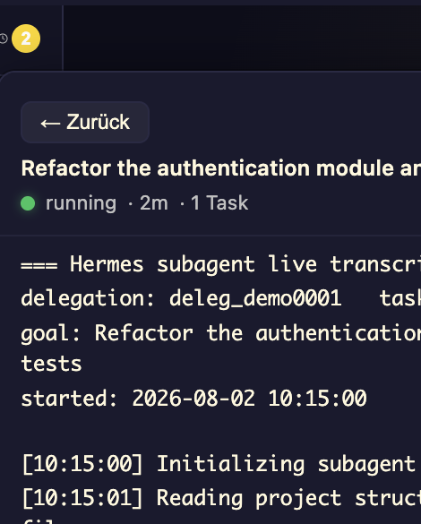

# Delegation Monitor

A live panel for [hermes-webui](https://github.com/nesquena/hermes-webui) that shows running and recently completed `delegate_task` subagent delegations directly in the sidebar. Click any entry to open its live transcript.



*Screenshot shows example data.*

## Features

- **Sidebar Button** — shows a running count of active delegations (e.g. "Delegation Monitor (3 running)")
- **Live Panel** — lists all delegations with status, duration, task count, and timestamp
- **Detail View** — click any delegation to see its full live transcript with auto-scroll to the end
- **Batch Support** — when a delegation spawns multiple tasks, they appear as tabs within the detail view
- **Efficient Polling** — only fetches data while the panel is open; no background overhead

## Installation

### Quick Install

```bash
git clone https://github.com/rewasa/hermes-webui-extension-delegation-monitor.git
cd hermes-webui-extension-delegation-monitor
./install.sh
```

The install script will:
1. Copy the extension files to the correct extension directory
2. Find a suitable Python interpreter
3. On macOS: create and load a `launchd` LaunchAgent to run `refresh.py` every 10 seconds
4. On Linux: print instructions for setting up a systemd timer or cron job

### Manual Installation

1. Copy the extension directory to your hermes-webui extensions folder:
   ```bash
   cp -r delegation-monitor $HOME/.hermes/webui/extensions/
   ```
2. Set up the refresh script to run periodically (every 10 seconds recommended):
   - **macOS (launchd):** Create a LaunchAgent plist that runs `refresh.py` every 10 seconds
   - **Linux (systemd):** Create a systemd timer or add a cron entry
3. Restart hermes-webui (or reload the browser page — the server injects extension assets on every page load)

## How It Works

The extension consists of two parts:

### Backend: `refresh.py`
A Python script that reads delegation data from Hermes' internal state and writes it as static JSON files into the `data/` directory:
- `data/delegations.json` — summary of all delegations
- `data/logs/<delegation_id>.json` — full transcript for each delegation

### Frontend: `app.js` + `app.css`
Vanilla JavaScript (no build step, no framework) that runs in the hermes-webui sidebar. It polls the static JSON files via same-origin `fetch()` and renders the panel.

### Why a static JSON file?

You might wonder why the frontend doesn't fetch delegation data directly from the Hermes API at `http://127.0.0.1:8787`. The reason is **Mixed Content blocking**:

When hermes-webui is served over HTTPS (e.g. via Cloudflare Tunnel at `https://hermes.example.com`), the browser blocks `fetch()` calls to `http://127.0.0.1:8787` because the page is secure but the target is not. Empirically measured:
- Fetch from HTTPS to `http://127.0.0.1:8787` → **timeout after 15 seconds** (blocked by Mixed Content)
- Fetch to a dead port (`http://127.0.0.1:59999`) → **"Failed to fetch" in 3ms** (immediate rejection)

The Content Security Policy may allow `connect-src http://127.0.0.1:*`, but CSP does **not** override the browser's built-in Mixed Content blocking. The only reliable workaround is to serve the data same-origin — hence the static JSON files served under `/extensions/delegation-monitor/data/...`.

## Privacy

The `data/` directory contains real delegation targets and full transcripts of subagent conversations, including project names, file paths, and work content. This directory is **excluded from version control** via `.gitignore`. Never commit or share this data.

## Requirements

- [hermes-webui](https://github.com/nesquena/hermes-webui) with extension support enabled
- Python 3
- macOS (launchd) or Linux (systemd / cron)

## Author

**Renato Wasescha** — [https://github.com/rewasa](https://github.com/rewasa)

## License

MIT
